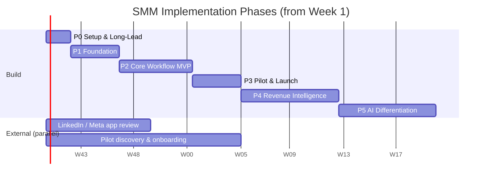

# SMM Implementation Phases
## Phase-by-Phase Delivery Plan (Solo Founder + AI)

> **Version:** 2.0 | **Updated:** 2026-10-07 | **Owner:** Founder
> **Governed by:** `Plan/02_Execution/SMM_Decisions_Log.md`
> **Task-level to-do list:** `Plan/02_Execution/SMM_Autonomous_Development_Checklist.md`
> **Detailed acceptance criteria (reference):** `Plan/03_Backlogs/`

---

## 1) Phase Overview

| Phase | Name | Weeks | Goal | Exit Gate |
|---|---|---|---|---|
| **0** | Setup & Long-Lead Items | 1–2 | Remove external blockers before coding | Accounts ready, platform reviews submitted, 3+ pilots lined up |
| **1** | Foundation | 3–6 | Secure, deployable skeleton | Login → workspace shell on staging, CI green |
| **2** | Core Workflow MVP | 7–12 | `create → approve → schedule → publish` on LinkedIn | **Gate 1 – MVP Ready** |
| **3** | Pilot & Launch Readiness | 13–16 | Real users, billing, 2nd platform, basic analytics | **Gate 2 – First Paying Customer** |
| **4** | Revenue Intelligence | 17–24 | Prove social → revenue (core differentiator) | **Gate 3 – Attribution Proven** |
| **5** | AI Differentiation | 25–32 | NOVA planner, Content Score, Brand Voice, Inbox | **Gate 4 – AI Adoption** |
| **6** | Scale (after PMF) | 33+ | Enterprise, agency, mobile apps, more platforms | Driven by customer demand |

**Capacity assumption:** 15–25 story points per 2 weeks (solo founder with AI). Keep a **15% buffer** in every phase for platform API surprises and bug fixing.

---

## 2) Phase 0 — Setup & Long-Lead Items (Weeks 1–2)

**Goal:** Start everything that takes weeks of waiting (platform approvals, legal, pilots) *before* writing product code.

**Deliverables**
- Decisions Log reviewed; open decisions O1–O4 answered or defaulted.
- 10 customer discovery calls completed; 3–5 pilot design partners committed.
- LinkedIn, Meta and HubSpot developer apps registered; Meta App Review submitted.
- Cloud accounts created (Supabase, Redis, Vercel, Render/Railway, Sentry, PostHog, Razorpay test mode).
- Domain + short-link domain registered.
- Draft Privacy Policy and Terms of Service (required by platform app reviews).
- Git repository, GitHub remote, `CLAUDE.md` with project rules.

**Tasks:** `P0-01` … `P0-12`

**Exit criteria**
- [ ] All platform/developer applications submitted.
- [ ] At least 3 pilot partners agreed to a free pilot.
- [ ] Repo + `CLAUDE.md` ready for AI-assisted coding.

---

## 3) Phase 1 — Foundation (Weeks 3–6)

**Goal:** A secure, multi-tenant skeleton that deploys automatically.

**Deliverables**
- Monorepo: `apps/web` (current Vite app), `apps/api` (NestJS), `apps/worker`, `packages/shared-types`.
- Tailwind + shadcn/ui app shell; Redux Toolkit + RTK Query; mock API (MSW) for UI work without backend.
- Supabase Postgres + Prisma schema v1; Supabase Auth login; workspace context; RBAC guard.
- Health endpoints, standard error format, request logging, Sentry, audit event service.
- CI (lint, typecheck, test, build) and staging deploys.

**Tasks:** `P1-01` … `P1-12` (plus already-completed scaffold items)

**Exit criteria**
- [ ] User logs in on staging and sees their workspace shell.
- [ ] Wrong-workspace access returns 403; RBAC unit tests pass.
- [ ] CI blocks merges on failure.

---

## 4) Phase 2 — Core Workflow MVP (Weeks 7–12)

**Goal:** The first real value — a team drafts, approves, schedules and auto-publishes LinkedIn posts.

**Deliverables**
- Drafts with version history and image upload.
- Approval workflow (submit / approve / reject with reason) + approval inbox.
- Scheduling with timezone, reschedule, unschedule.
- BullMQ worker with idempotency, retry/backoff, dead-letter.
- LinkedIn connector (OAuth, encrypted tokens, refresh, publish).
- Publish status UI with failure reasons and retry; calendar view.
- Full audit trail; Playwright E2E tests; publish-failure alerts.

**Tasks:** `P2-01` … `P2-16`
**Reference specs:** Sprint 1 Backlog (`SMM-101`–`SMM-114`), SMMPlan2 (`F7`–`F11`, `F20`–`F23`)

### Gate 1 — MVP Ready
- [ ] A real LinkedIn post is published end-to-end from staging.
- [ ] Approval rules are enforced (Editor cannot self-approve).
- [ ] Retrying a failed job never creates a duplicate post.
- [ ] E2E suite green in CI; demo runs in under 5 minutes.

---

## 5) Phase 3 — Pilot & Launch Readiness (Weeks 13–16)

**Goal:** Real customers use it weekly and the first one pays.

**Deliverables**
- Self sign-up, workspace creation, team invites, onboarding flow, empty states.
- Email notifications (approval requests, decisions, publish failures).
- **Razorpay billing** with plans, trial and plan-limit enforcement.
- Meta connector (Facebook Pages + Instagram) — if app review approved.
- Basic analytics (metric ingestion + dashboard).
- Responsive layout + installable PWA (Android/iOS home screen).
- Viewer role; privacy features (consent, data export, account deletion).
- PostHog analytics and per-workspace feature flags; in-app feedback.
- Public landing page with pricing.

**Tasks:** `P3-01` … `P3-13`

### Gate 2 — First Paying Customer
- [ ] ≥ 3 pilot workspaces active every week for 3 weeks.
- [ ] ≥ 1 paid subscription processed through Razorpay.
- [ ] Publish success rate ≥ 98% over the last 14 days.

---

## 6) Phase 4 — Revenue Intelligence (Weeks 17–24)

**Goal:** Deliver the core promise — "this post/campaign generated ₹X in pipeline."

**Deliverables**
- Campaigns + automatic UTM tagging.
- Tracked short-link redirect service; optional consented site script.
- Deterministic identity stitching (email / CRM ID — no fingerprinting).
- HubSpot connector (incremental sync with checkpoints).
- Linear attribution engine with backfill.
- Revenue dashboard with drill-down trace, CSV export, data-freshness indicator.
- Brand Kit + AI caption writer; AI usage metering and per-plan credit limits.

**Tasks:** `P4-01` … `P4-12`
**Reference specs:** Sprint 2 Backlog (`SMM-201`–`SMM-206`, `SMM-214`), SMMPlan2 (`F13`, `F15`, `F27`, `F29`)

### Gate 3 — Attribution Proven
- [ ] At least one pilot sees attributed pipeline/revenue traced back to a specific post.
- [ ] Attribution credits always sum to 100% per conversion (automated test).
- [ ] ≥ 1 customer upgrades or pays for the attribution add-on.

---

## 7) Phase 5 — AI Differentiation (Weeks 25–32)

**Goal:** Make the product clearly smarter than schedulers.

**Deliverables**
- NOVA memory (pgvector) + 30-day campaign planner with strict JSON output; plan → drafts.
- Content Score v1 (rules + LLM rubric, warn-only) with recommendations.
- Brand voice profile, deviation check and rewrite suggestions.
- Unified inbox (comments first) for connected platforms.
- Shared explainability component; AI quality and cost metrics.

**Tasks:** `P5-01` … `P5-10`
**Reference specs:** Sprint 2 (`SMM-207`–`SMM-211`), Sprint 3 (`SMM-302`–`SMM-309`, `SMM-313`), SMMPlan2 (`F24`–`F26`)

### Gate 4 — AI Adoption
- [ ] ≥ 40% of active workspaces use NOVA or Content Score weekly.
- [ ] NOVA plan acceptance/edit ratio and AI cost per workspace are tracked.
- [ ] AI cost stays below 20% of revenue per workspace.

---

## 8) Phase 6 — Scale (After PMF, Week 33+)

**Goal:** Expand by customer demand. Re-prioritize this list every month with pilot feedback.

| Priority | Module | Task | Reference |
|---|---|---|---|
| 1 | Compliance policy engine + audited override | `P6-01` | Sprint 4 `SMM-410`–`412` |
| 2 | White-label agency reports + Client role | `P6-02` | Sprint 4 `SMM-413`–`414` |
| 3 | Multi-step approval chains | `P6-03` | Blueprint §6.4 |
| 4 | Android/iOS apps via Capacitor + push notifications | `P6-04` | Decision D9 |
| 5 | Competitor benchmarking (official APIs only) | `P6-05` | Sprint 3 `SMM-310`–`312` |
| 6 | Localization (master → variants, regional approvals) | `P6-06` | Sprint 4 `SMM-401`–`405` |
| 7 | Influencer module (licensed data provider) | `P6-07` | Sprint 4 `SMM-406`–`409` |
| 8 | Salesforce connector | `P6-08` | SMMPlan2 `F28` |
| 9 | More platforms (X, TikTok, YouTube, Threads) | `P6-09` | Blueprint §8.4 |
| 10 | Content Score v2 (trained ML model) | `P6-10` | Sprint 3 `SMM-301` |
| 11 | NOVA v2 autonomy with human-approval guardrails | `P6-11` | Blueprint §7.1 |
| 12 | Public API | `P6-12` | Blueprint Phase 4 |

---

## 9) Cross-Phase Rules

1. **Never start a phase until the previous gate passes** (exception: Phase 0 external tasks run in parallel throughout).
2. **One platform at a time.** A new connector starts only after the previous one is stable.
3. **Every new module ships behind a feature flag.**
4. **Every Friday:** update the checklist progress log, review KPIs, adjust next week's scope.
5. **If KPIs (publish success, critical bugs) degrade for 2 weeks:** stop feature work and stabilize.
6. **Pilot feedback beats roadmap:** if pilots ask for something not on the list, re-rank Phase 6.

---

## 10) Phase KPIs

| Phase | KPI | Target |
|---|---|---|
| 0 | Discovery calls / pilots committed | 10 / 3+ |
| 1–2 | CI pass rate, E2E pass rate | 100% on main |
| 2–3 | Publish success rate | ≥ 98% |
| 3 | Weekly active pilot workspaces | ≥ 3 |
| 3+ | Paying customers, MRR (₹) | First ₹ by Week 16 |
| 4 | Attributed revenue visible per pilot | ≥ 1 pilot |
| 5 | Weekly AI feature usage | ≥ 40% of active workspaces |
| All | AI spend vs budget | Within monthly cap |

---

## 11) Old-to-New Mapping (Where Previous Plans Went)

| Previous plan item | Now in |
|---|---|
| Sprint 1 (Workflow MVP) | Phase 1 + Phase 2 |
| Sprint 2 – Attribution | Phase 4 |
| Sprint 2 – NOVA v1 | Phase 5 |
| Sprint 3 – Content Score, Brand Voice | Phase 5 |
| Sprint 3 – Competitor Benchmarking | Phase 6 |
| Sprint 4 – Localization, Influencer, Compliance, White-label | Phase 6 |
| SMMPlan2 F1–F6 (infra) | Phase 1 |
| SMMPlan2 F7–F12, F20–F23 (publishing, workflow) | Phase 2 |
| SMMPlan2 F17–F19 (analytics), F30–F32 (polish) | Phase 3 |
| SMMPlan2 F13, F15, F27, F29 (AI writer, brand kit, HubSpot, UTM) | Phase 4 |
| SMMPlan2 F24–F26 (inbox) | Phase 5 |
| SMMPlan2 F14, F16, F28 (AI image, bulk upload, Salesforce) | Phase 6 / backlog |
| Billing, onboarding, invites, privacy, PWA (previously missing) | Phase 3 |
