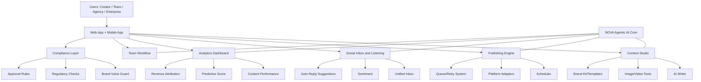
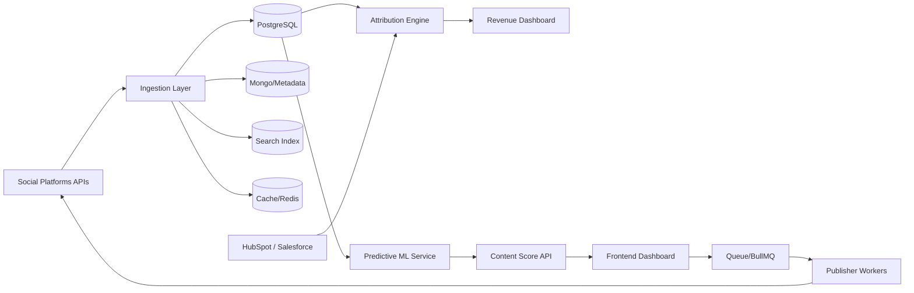
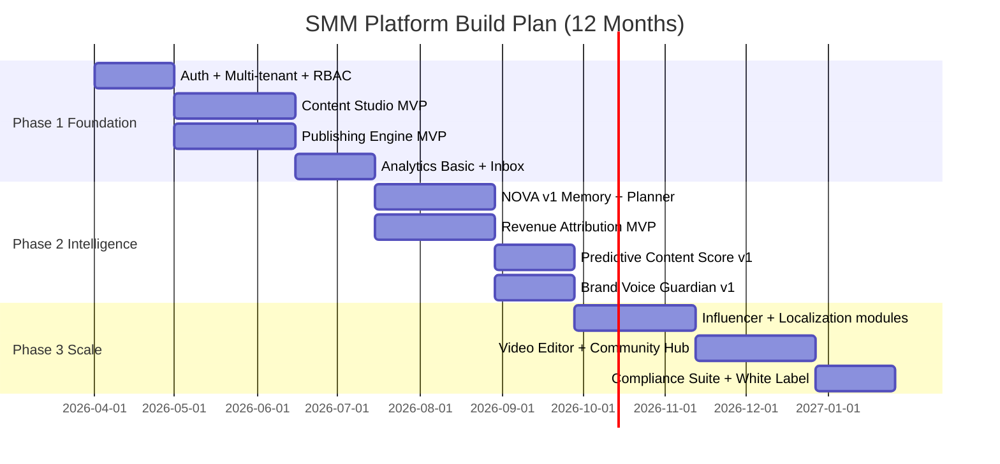

# SMM Platform Development Guide

> **Architecture reference (v2.0, 2026-10-07):** Where this file differs from `Plan/02_Execution/SMM_Decisions_Log.md` §3–4 (stack, auth, database, naming), the Decisions Log wins. Key overrides: Supabase Auth (no custom login code), PostgreSQL only (no MongoDB/Elasticsearch), Redux Toolkit + RTK Query (no Zustand/React Query), Tailwind + shadcn/ui (no MUI), `apps/worker` path.

## Pictorial Representation + Step-by-Step Build Plan

---

## 1) Product System Map

---

## 2) Data + Integration Flow

---

## 3) Development Roadmap Visual

---

## 4) Step-by-Step Guideline to Start Development

### Step 0: Lock MVP Scope (3-5 days)
- Freeze MVP to: Content Studio basic, Scheduler, Inbox, Basic Analytics, Team approvals.
- Define MVP roles: `Admin`, `Editor`, `Approver`.
- Write top 10 must-ship user stories.

### Step 1: Foundations (Week 1)
- Confirm stack: React + TypeScript, NestJS, PostgreSQL, Redis, BullMQ.
- Define API standards (`/api/v1`, error format, auth pattern).
- Set baseline security and logging standards.

### Step 2: Data Model (Week 1-2)
Build entities:
- Workspace, User, Role, SocialAccount
- ContentItem, ContentVersion, MediaAsset
- PublishJob, PlatformPost, ApprovalFlow
- Message, Conversation, Tag
- MetricSnapshot, AttributionEvent

### Step 3: Platform Skeleton (Week 2-3)
- Monorepo layout:
  - `apps/web`
  - `apps/api`
  - `services/worker`
  - `packages/shared-types`
- Add CI checks: lint, test, build.
- Add basic observability.

### Step 4: Vertical Slice #1 (Week 3-4)
Flow: create post -> approve -> schedule -> publish
- Content editor + approval pipeline
- Scheduler API + queue worker
- First platform connector (LinkedIn or X)
- Publish status UI

### Step 5: Vertical Slice #2 (Week 4-5)
Flow: inbox + engagement handling
- Unified inbox model
- DM/comment ingestion for one platform
- Assign/reply workflow
- SLA tracking

### Step 6: Vertical Slice #3 (Week 5-6)
Flow: performance visibility
- Daily metric ingestion
- Basic dashboard (reach/clicks/engagement/top posts)
- Export baseline report (CSV/PDF)

### Step 7: AI Layer v1 (Week 6-8)
- AI writing assistant with brand prompts
- Best-time posting suggestion
- Safety and moderation filters
- Feature flags for controlled rollout

### Step 8: Security and Compliance Hardening (Week 8-9)
- Enforce RBAC across all routes
- Immutable audit log
- Secret management and API throttling
- Webhook signature validation

### Step 9: Beta Launch Prep (Week 9-10)
- Onboard 5-10 design partner customers
- Track key metrics:
  - Publish success rate
  - Time to publish
  - Weekly active teams
  - Content throughput
- Add in-app feedback mechanism

### Step 10: Post-MVP Expansion (Month 3+)
Priority:
1. Revenue attribution MVP
2. NOVA memory + planner
3. Predictive content score
4. Localization + compliance suite
5. Influencer and community modules

---

## 5) First 14-Day Execution Plan

- Day 1-2: Finalize MVP stories and schema draft
- Day 3-4: Repo setup, CI, env setup, auth scaffold
- Day 5-6: Content + approval APIs
- Day 7-8: Scheduler + worker queues
- Day 9-10: First social connector + status UI
- Day 11-12: Metric ingestion + basic dashboard
- Day 13: E2E tests + bug fixes
- Day 14: Internal demo + scope adjustments

---

## 6) Recommended Team Setup

- 1 Product Manager
- 1 Tech Lead
- 2 Frontend Engineers
- 2 Backend Engineers
- 1 ML/AI Engineer
- 1 QA/Automation Engineer
- 1 DevOps Engineer (part-time early, full-time near beta)

---

## 7) Immediate Next Action

Start with:
1. MVP scope freeze
2. Data model draft
3. Vertical Slice #1 implementation
